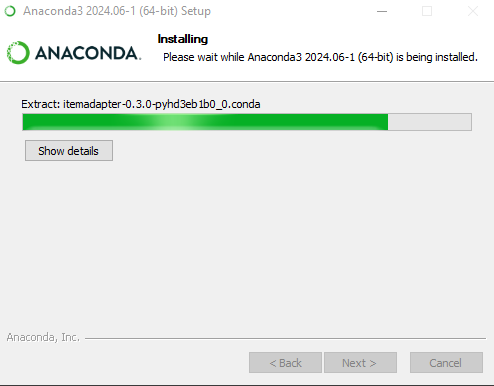

# Aprendiendo-Jupyter-Notebook-con-Anaconda
Guia para instalar y usar jupyter notebook con anaconda, python

tomado de: https://www.youtube.com/watch?v=AlgyR1txA3Y

## Instalando Anaconda

- en https://www.anaconda.com/ descargar el instalador,
- se coloca el correo para que llegue el link de descarga
- aplica para windows, linux y mac

- se recomienda ejecutar anaconda como administrador,
- la primera vez que inicia se puede demorar unos minutos,
- una vez que abra muestra la pantalla del anaconda navegator
- si sale alguna actualizacion recomendada entonces ejecutarla

## Creando el entorno virtual o enviroments

- se recomienda crear un entorno con jupyter
- 

- una vez se haya instalado el entorno proceder a activar el jupyter en ese entorno, en la pestaña de *home*,

- me da un error,

- lo reinicio para ejecutarlo como administrador

- se usa IA indica algunos comandos para actualizar desde consola el python, no abre directamente en el launch, solo funciona desde la consola ejecutando:

    jupyter notebook

- una vez que se inicia el servidor web es necesario abrirlo con el token que se indica en la consola.

- creando un nuevo notebook

- si por ejemplo se intenta importar alguna libreria y no funciona entonces se debe instalar desde la consola

    pip install pandas

- verificando tambien lo puedo ejecutar en el notebook, me pide reiniciar el notebook y funciona

- en jupyter se puede ejecutar 

    !pip install pandas

- una vez se tenga el programa se puede descargar el programa para python o html etc

